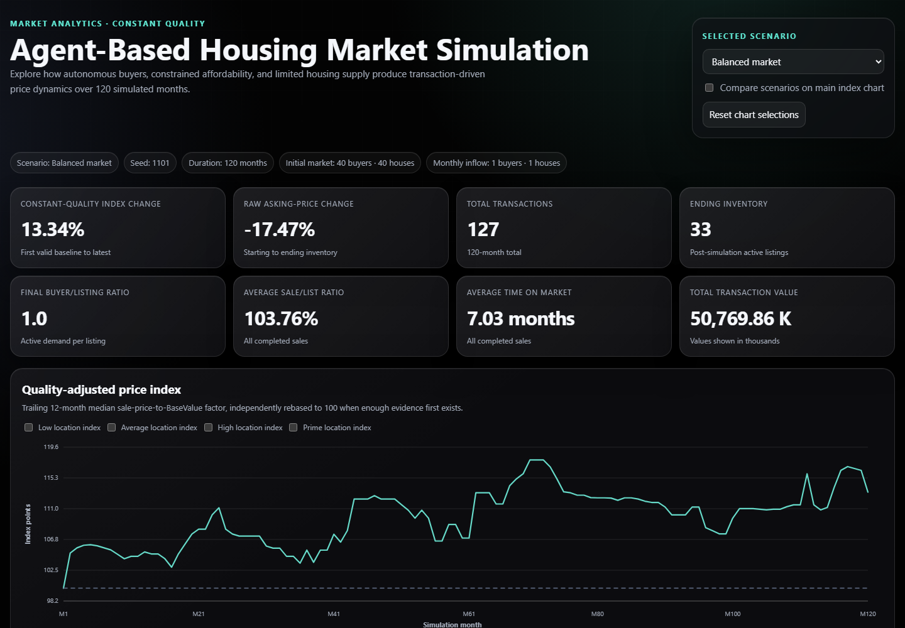
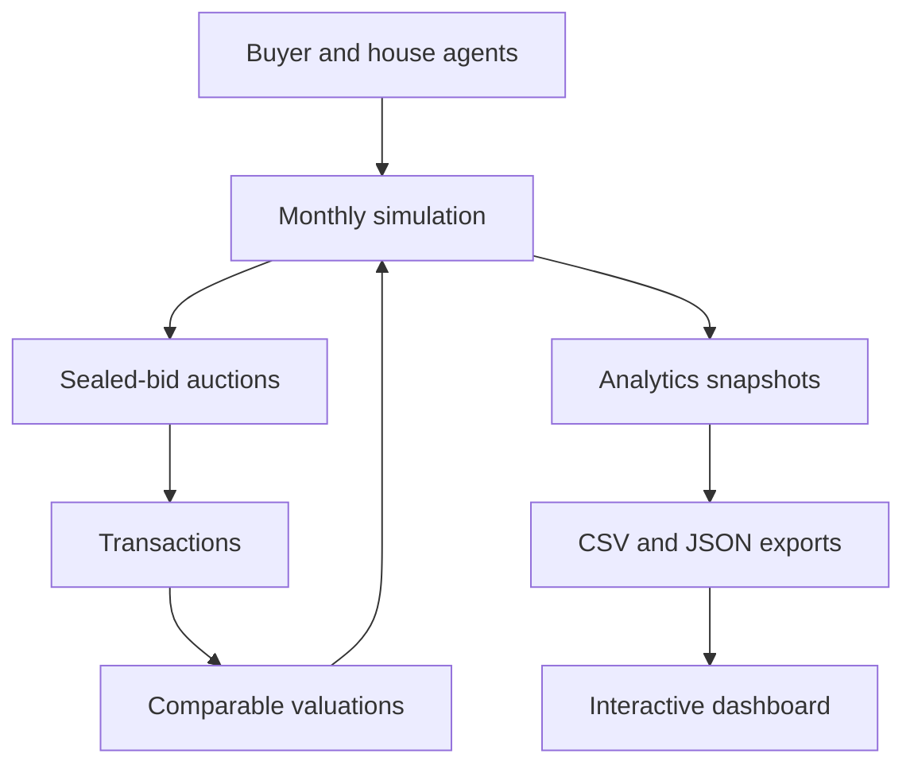
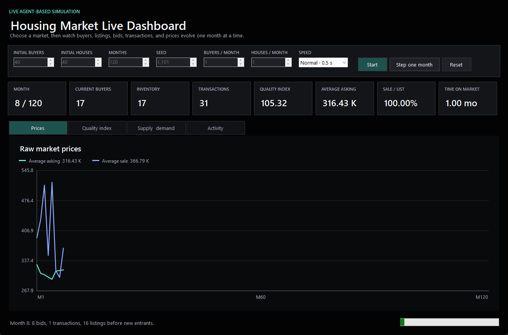

# Agent-Based Housing Market Simulation

A deterministic agent-based housing market simulation in C# where autonomous
buyers compete for properties, completed transactions influence future prices,
and an interactive dashboard compares supply-and-demand scenarios.

[](https://dotnet.microsoft.com/)
[](https://github.com/ShanedalyCS/HousingMarketSimulation/actions/workflows/dotnet.yml)

## Live demo

> **Deployment pending:** GitHub Pages deployment is prepared and will publish
> the dashboard from `main` after this release PR is reviewed, merged, and Pages
> is configured to use GitHub Actions. No unverified URL is presented here.

## Dashboard preview



The self-contained dashboard runs entirely in the browser with embedded,
deterministic scenario data. It needs no server, CDN, JavaScript framework, or
network connection.

## Key findings

| Scenario | Raw asking-price change | Quality-adjusted index | Sale-to-list ratio | Average time on market |
|---|---:|---:|---:|---:|
| Balanced | -17.47% | 113.34 | 103.76% | 7.03 months |
| Excess demand | -25.14% | 115.80 | 107.79% | 2.07 months |
| Excess supply | -8.26% | 105.64 | 100.77% | 12.18 months |

Excess demand produced the strongest quality-adjusted price growth, highest
sale-to-list ratio, and shortest sale time. Its raw remaining-inventory average
still fell because desirable and higher-priced properties left the active
listing stock while a different mix remained. The quality-adjusted index helps
expose that underlying transaction-price pressure.

These deterministic scenarios explain model behaviour; they do not establish
real-world housing-policy conclusions.

## What this project demonstrates

- Object-oriented C# design with explicit domain, service, simulation,
  reporting, and analytics boundaries.
- Agent-based, discrete-time simulation with deterministic random modelling.
- Heterogeneous preferences, affordability constraints, and sealed-bid auction
  settlement.
- Transaction-driven comparable valuation and persistent seller pricing.
- Rolling quality-adjusted indexing and stock-versus-flow market analysis.
- Stable invariant-culture CSV and nullable JSON exports.
- Responsive, accessible SVG visualisation using dependency-free HTML, CSS, and
  vanilla JavaScript.
- A native Windows Forms dashboard that advances the real C# simulation one
  month at a time and redraws charts live.
- xUnit regression and 120-month scenario testing.
- GitHub Actions CI/CD and automated static-site deployment.

## How it works

Every month is processed in a fixed order:

1. Active buyers save part of their income and active listings age by one month.
2. Completed transactions update comparable valuations.
3. Asking prices move gradually toward persistent seller targets.
4. Buyers rank houses using personal location, quality, size, plot, and age
   preferences.
5. Affordability limits cap willingness to pay.
6. Buyers submit at most one sealed bid; qualifying auctions settle using
   asking price and second-price evidence.
7. Sold houses and successful buyers leave the market.
8. Unsuccessful listings adjust prices.
9. Reporting and analytics capture the post-settlement market before new
   entrants arrive.



### Buyer and seller decisions

Buyers calculate suitability from normalized preferences, then combine it with
estimated market value and motivation:

```text
perceived value = EstimatedMarketValue × (0.80 + 0.40 × suitability)
motivated value = perceived value × (1 + motivation / 200)
maximum bid = min(motivated value, affordability limit)

affordability limit =
    min(savings / 20%, savings + annual salary × 4)
```

Each seller receives a seeded multiplier that persists for the listing's
lifetime. Asking prices move toward:

```text
seller target = EstimatedMarketValue × persistent seller multiplier
```

Completed sales therefore affect subsequent comparable valuations, buyer bids,
seller targets, and future transactions without replacing the fundamental
property valuation.

## Analytical methodology

Raw averages can move because the types of houses sold or remaining change. The
constant-quality index normalizes each eligible sale by that house's immutable,
modeled fundamental value:

```text
MarketFactor = median(SalePrice / BaseValue)
PriceIndex = 100 × CurrentMarketFactor / BaselineMarketFactor
```

- Uses a configurable trailing 12-month window.
- Bounds eligible sale-to-base ratios to 0.50–2.00.
- Establishes the baseline at the first window with at least five valid overall
  transactions.
- Uses a three-transaction minimum for Low, Average, High, and Prime location
  indices.
- Independently rebases every scenario to 100.
- Represents sparse or mathematically undefined periods as unavailable rather
  than zero, `NaN`, or infinity.

Monthly analytics cover raw prices, constant-quality indices, active buyers and
listings, listing inflow, bids, transactions, clearance, ending inventory,
months of supply, sale time, sale-to-list ratios, transaction value, and
affordability. Evaluation-time affordability is captured while successful
buyers and sold houses are still active; ending inventory is captured after
settlement and unsuccessful-listing adjustments but before entrants.

This is a simulation-specific explanatory index. `BaseValue` is a transparent
model input, not a real hedonic valuation or an official house-price index.

## Running locally

Requires the .NET 10 SDK. From the repository root:

```powershell
dotnet test HousingMarketSimulation.slnx
dotnet run --project src/HousingMarketSimulation
dotnet run --project src/HousingMarketSimulation.Desktop
dotnet run --project src/HousingMarketSimulation -- --scenarios
dotnet run --project src/HousingMarketSimulation -- --dashboard
```

### Live desktop dashboard

On Windows, run:

```powershell
dotnet run --project src/HousingMarketSimulation.Desktop
```



Enter initial buyers, initial houses, duration, seed, and monthly buyer/house
inflows. Then:

- **Start** advances the simulation automatically at the selected speed.
- **Pause** stops after the current monthly tick.
- **Step one month** advances exactly one tick for closer inspection.
- **Reset** unlocks the inputs and creates a fresh deterministic session.

Choose **Instant · no delay** to run ticks back-to-back while still yielding to
the Windows message loop between months so the dashboard can repaint and Pause
remains responsive. Eight KPI cards and five chart views update after every
tick. Each time-series chart's x-axis expands to the latest completed month, so
a run at month 10 ends at M10 and a long run continues scaling through M1200
rather than reserving the configured duration in advance. The **Supply vs
price** view is a scatter chart with active house listings on the x-axis and
average asking price on the y-axis; each point represents one simulated month.
The **Supply & demand** view compares active buyers with the houses available at
the start of each month's trading. Ending inventory remains available in the
analytics exports but is omitted from this view because it is simply the
post-transaction, pre-new-listing balance for the same month. Houses on market
use a dashed gold line so both series remain visible when their values coincide.

The desktop app uses `LiveSimulationSession`, which delegates directly to the
existing `Simulation.RunTick()` method; it does not reimplement market logic.

Interactive mode asks for initial counts, duration, an optional seed, and
simulation settings. It writes:

```text
monthly-market-reports.csv
monthly-analytics.csv
dashboard-data.json
```

Scenario and dashboard modes write:

```text
analysis-output/
  index.html
  dashboard.html
  scenario-comparison.json
  balanced-market/
    monthly-market-reports.csv
    monthly-analytics.csv
    dashboard-data.json
  excess-demand-market/
    ...
  excess-supply-market/
    ...
```

Open `analysis-output/index.html` directly or serve `analysis-output/` as a
static site. `dashboard.html` is an identical compatibility copy.

## Testing and reproducibility

The verified suite contains **79 passing xUnit tests**. Coverage includes:

- transaction timestamps and auction settlement;
- affordability, preferences, valuation, and seller feedback;
- snapshot lifecycle timing and stock-versus-flow boundaries;
- median factors, baseline rebasing, rolling windows, outliers, and location
  segmentation;
- composition-bias regression cases;
- CSV/JSON schemas, null handling, and deterministic exports;
- dashboard generation and Pages entry-point parity;
- live-session tick boundaries, completion, validation, and deterministic
  replay;
- reproducible 120-month balanced, excess-demand, and excess-supply scenarios.

Supplying the same seed and settings reproduces generated agents, property
characteristics, buyer choices, bid ties, transactions, reports, and analytics.
GitHub Actions restores, builds, and tests every pull request targeting `main`.
A separate Pages workflow repeats Release build and tests before generating and
deploying the dashboard from merged `main`.

## Architecture

```text
src/HousingMarketSimulation/
  Analytics/       rolling indices and monthly analytical snapshots
  Configuration/   simulation, valuation, and analytics settings
  Dashboard/       offline template and dashboard generator
  Data/            runtime seed data
  Domain/          buyers, houses, bids, and transactions
  Reporting/       CSV and JSON exporters
  Services/        bidding, valuation, pricing, and buyer decisions
  Simulation/      market lifecycle, scenarios, and data generation
src/HousingMarketSimulation.Desktop/
  LiveDashboardForm.cs   Windows Forms controls and simulation timer
  LiveLineChart.cs       dependency-free live chart rendering
tests/HousingMarketSimulation.Tests/
docs/assets/
```

## Model boundaries

- Behaviour is explanatory rather than empirically calibrated.
- Interest rates, repayments, taxes, transaction costs, construction delays,
  and rental markets are outside the model.
- Sellers remain rule-based rather than strategic learning agents.
- Successful buyers leave the market, so post-purchase cash flow is not
  represented.
- The quality index observes only completed transactions and can still reflect
  unmodeled differences within the fundamental valuation.
- Simulated `BaseValue` is a cost-based reference, not a real hedonic estimate.
